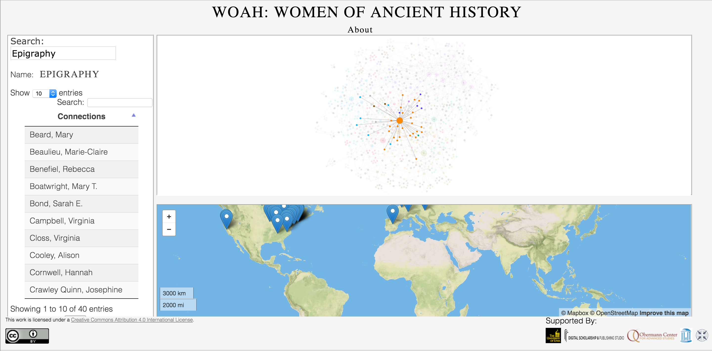

# [WOAH](http://s-lib024.lib.uiowa.edu/bam/modules/woah/main.php)
Women of Ancient History Project and Data

---

The ["manel"](http://allmalepanels.tumblr.com/), or all male panel, is a prevalent occurence within the field of ancient history. 
In order to combat this, [BAM] (http://www.lib.uiowa.edu/bam/) set up a crowd-sourced .csv file so that a list of women in the field could be 
compiled and subsequently kept updated through the years. This list has no one author, 
but is rather a product of over 100+ women and men who took the time to contribute. 
We hope that you use it to reach out to a female ancient historian in order to write a review, 
to be on a panel, to write an article, or just to read her work. 
